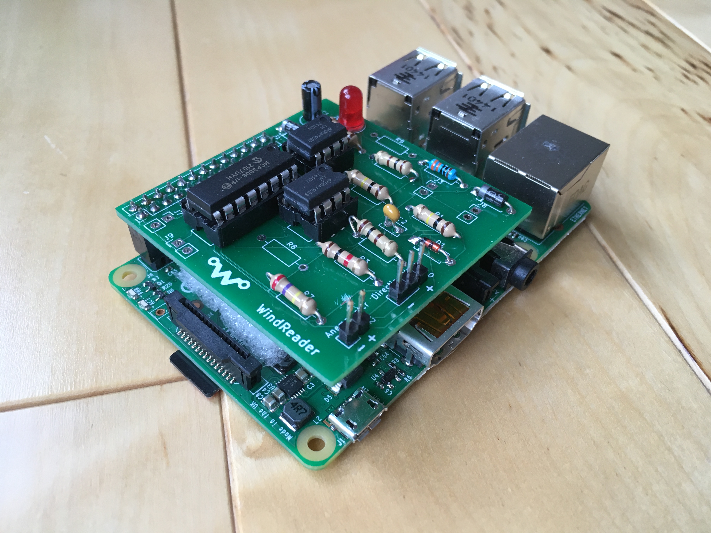

# WindReader

WindReader is a Raspberry Pi hat for reading sensor data from the NRG #40 Anemometer and the NRG 200P direction vane from NRG Systems. 

It uses the popular LM741 op amp as well as the MCP3008 analog to digital converter in order to send the analog sensor readings 
to the Raspberry Pi.

The project started when I scored some free wind sensors from an old weather station. It seemed like the perfect opprotunity to try 
my hand at pcb design! 

Unfortunatly, upon further inspection, the only direction vane I got didn't work but in theory the circuit should work fine. 
If I am able to get my hands on a working one I will confirm this.
